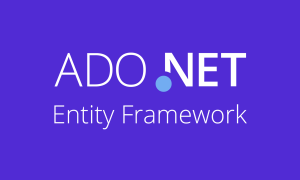

# dotNet Logo Pack by campusMVP

Fan-made logos for .NET, ASP.NET and ASP.NET MVC **for .NET 5 and later**.

> If you're looking for our .NET Core logos, [check out this repo](https://github.com/campusMVP/dotnetCoreLogoPack)

Microsoft's policy regarding product logos is not releasing any logos for individual products that are not their "main" lines of business. The result is that .NET Core, SQL Server and many other great products don't have an official logo to be used in presentations, blogs, etc. So [we created our own for .NET Core](https://github.com/campusMVP/dotnetCoreLogoPack), and they have been wildly successful since we released it to the community back in 2016.

With **.NET 5**  Microsoft has decided to release some [official brand guidelines](https://github.com/dotnet/brand) to be used by you in your contents. We find [the semi-official logo](https://github.com/dotnet/brand/blob/master/logo/dotnet-logo.png) too simple and "lazy". So, once again, we decided to create our own one, and we're releasing it as Creative Commons for everyone to use, if you prefer this one to the official one.

These are the **basic designs**:

You can find the logos in this repository **in bitmap and vector formats and with different sizes and variations** including squared, horizontal, B&W, negative... all of them using the **official colors**. For example:

## Designer
Logos designed by [campusMVP](https://www.campusmvp.es) staff designer [Pablo Iglesias](https://twitter.com/piglesias).

## License

These logos are licensed under Creative Commons 4.0-Share Alike-By license. You can read the license in this repository, or following the link in this CC logo:

## Disclaimer
We are not in any way related to Microsoft neither pretend to represent the company in any way. We're only a group of enthusiasts from the community that wanted to have a nice logo for our communications related to these technologies.
